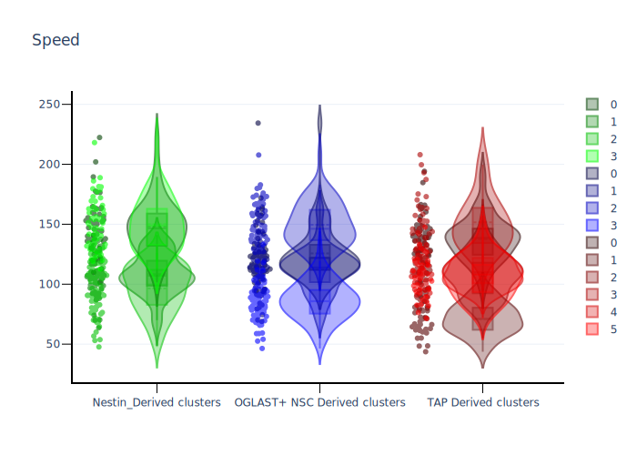

# Cluster analysis pipeline

Cluster analysis pipeline is a general code to investigate clusters in dataset.
This pipeline was used to investigate clusters related to the migrations of different populations : https://www.cell.com/stem-cell-reports/fulltext/S2213-6711(22)00100-X

However, this pipeline can be use for any biological dataset.
Please if you use this code, cite us :

`Ferreira A, Bressan C, Hardy SV, Saghatelyan A. Deciphering heterogeneous populations of migrating cells based on the computational assessment of their dynamic properties. Stem Cell Reports. 2022 Mar 17. `

Table of Contents
=================
* [Cluster analysis pipeline](#cluster-analysis-pipeline)
* [Table of Contents](#table-of-contents)
   * [Installation](#installation)
      * [Get repository](#get-repository)
      * [Create and configure new environment](#create-and-configure-new-environment)
   * [Verify installation](#verify-installation)
      * [Unit tests](#unit-tests)
   * [Analysis](#analysis)
      * [CLI analysis](#cli-analysis)
      * [GUI analysis](#gui-analysis)
      * [In depth view of parameters](#in-depth-view-of-parameters)
      * [Output examples](#output-examples)
## Installation

If you are new to python you can follow these instructions : 

Install and start python, for this code we used python/3.9, click on this link and go to the end of the page https://www.python.org/downloads/release/python-3910/.
To ensure reproducibility we added some unit tests.


### Get repository

If you have git you can use :
`git clone https://github.com/SaghatelyanLab/clusterAnalysis.git`

Otherwise click on the Code button and Download Zip.
Once the file is downloaded extract it.

### Create and configure new environment

Start console and move to the folder where the code was downloaded.

`cd path_to_code_folder`

Windows (command prompt) : 
Go to the repository of python, shift + right click "open command prompt here"

Go back to the Code folder
`cd path_to_code_folder`

```
python -m venv clusterAnalysis
cd clusterAnalysis/Scripts
activate.bat
cd ../..
pip install -r requirements.txt
```

Windows (Powershell) :
Go to the repository of python, shift + right click "open powershell here"

Go back to the Code folder
`cd path_to_code_folder`

```
python -m venv clusterAnalysis
cd .\clusterAnalysis\Scripts\
.\activate
cd ../..
pip install -r requirements.txt
```

MacOS/Linux : 
Note that MacOS and Linux often provides both python2 and python3. If you use MacOS or Linux you should probably replace all python calls to python3.

Go back to the Code folder
`cd path_to_code_folder`

```
python3 -m venv clusterAnalysis
source clusterAnalysis/bin/activate
pip install -r requirements.txt
```

All requirements are now installed. Don't forget to load again the environment everytime you restart the console.

## Verify installation

### Unit tests

We use some external packages. In the requirements.txt we fixed the version of these packages to ensure that there is
no modifications. <br />
If you loaded the packages differently or just to be sure that environment is loaded please run tests.

```
cd unit_tests
pytest .
cd ..
```

This should return 6 passed test. If not please check your configuration. If this is still failing please open an issue
in GitHub with the maximum of information.

## Analysis

> **GUI** : We created a Graphical User Interface if you are not use to JSON format or have difficulty to modify this file, please refer to according [section](#GUI).

### CLI analysis

Open in any text editor and modify general_analysis_parameters.json  <br />
Start your terminal in the appropriate folder <br />
**Load the environment** <br />
Then type :

```
python analyse.py
```

If you saved the model you can reuse the pre-trained model for further analysis in this case modify
apply_model_parameters.json 

Open python

**Load the environment**
```
python apply_saved_model.py
```

### GUI analysis

We provide a simple GUI to help to create the json file. To use it, open the terminal in the appropriate folder
**load the environment** and simply type :

```
python analysis_gui.py
```

To load and apply already saved PCA and K-means : 

```
python apply_saved_model_gui.py
```


### In depth view of parameters

**DataSetPath** : a relative path or absolute path (recommended) to a dataset in .csv format. <br />
**FeaturesColumns** : a list of columns names in the dataset (columns names needs to be inside "" and separated by a comma then all columns names needs to be inside []) example :  ["Column 1", "Column 2"] <br />
**ComparisonColumn** : a column name to compare the populations and generate clusters (example : Sex) <br />
**Seed** : a number or the value "RANDOM", it's common practice investigating randomly multiple seed and then fix seed can be necessary for reproducibility. <br />
**Number of PCs** : number of principal components to reduce the data (number of principal components needs to be lower than the number of features) <br />
**Kmeans** : a dictionary of population and the number of clusters to associate (example : {"Male": 3, "Female" : 3}) <br />
**Show Violin** : a boolean ("true", "TRUE", True, true, or "false", "FALSE", False, false) to show a violin plot of each column used as a feature and each principal columns of the graphs <br />
**Save Violin** : a boolean ("true", "TRUE", True, true, or "false", "FALSE", False, false) to save the violin plot as vectorial graphs (.svg) <br />
**Save Model** : a boolean ("true", "TRUE", True, true, or "false", "FALSE", False, false) to save the standard scalar transformation and the pca transformation as a pickle file to be reused later. Save also the K-means trained models to be reused later. <br />
**Show cluster** : a boolean ("true", "TRUE", True, true, or "false", "FALSE", False, false) to show in the terminal some information about the clusters and the features related to it. <br />
**Save dataframe** : a boolean ("true", "TRUE", True, true, or "false", "FALSE", False, false) to save a dataset with the  <br />
**PCA model path** : a relative path or absolute path (recommended) to a previously saved PCA model. <br />
**Kmeans model path** : a relative path or absolute path (recommended) to a previously saved Kmeans model. <br />

### Output examples




